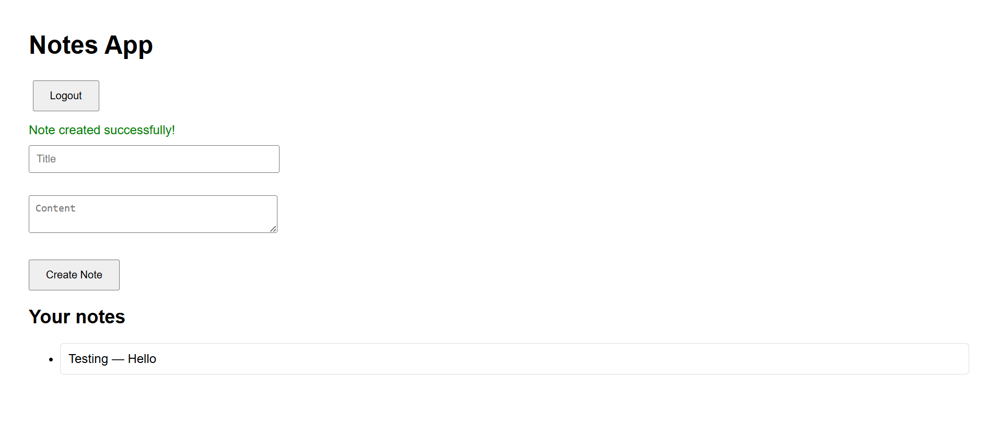

# AWS Serverless Web Application — Notes App


> A fully **serverless web application** on AWS, built using **Terraform**.  
> It provides secure user authentication (Cognito), API-based backend (Lambda + API Gateway), and scalable NoSQL data storage (DynamoDB), all served via S3 and CloudFront.

---

## Table of Contents
- [Overview](#overview)
- [Architecture](#architecture)
- [Technologies Used](#technologies-used)
- [Features](#features)
- [Project Structure](#project-structure)
- [Prerequisites](#prerequisites)
- [Setup Instructions](#setup-instructions)
- [Screenshots](#screenshots)
- [Contact](#contact)

---

## Overview
This project demonstrates a **modern, serverless web application** built on AWS using **Terraform (IaC)**.  
It is designed to be **scalable, cost-efficient, and secure**, showcasing a complete full-stack serverless architecture — from frontend to backend with authentication.

---

## Architecture


### Workflow
```
CloudFront + S3 → Cognito Authentication → API Gateway → Lambda → DynamoDB
```

---

## Technologies Used

| Category | Tool | Description |
|-----------|------|-------------|
| IaC | Terraform | v1.9+ for provisioning AWS resources |
| Authentication | Amazon Cognito | Secure user login & signup |
| API Management | Amazon API Gateway | RESTful API endpoints |
| Compute | AWS Lambda | Serverless function for CRUD logic |
| Database | Amazon DynamoDB | Scalable NoSQL storage |
| Frontend Hosting | Amazon S3 + CloudFront | Static web hosting + global CDN |
| Monitoring | Amazon CloudWatch | Lambda & API logs |
| Security | IAM Roles & Policies | Fine-grained access control |

---

## Features
- **Completely Serverless Stack (No EC2, No manual servers)**
- **Secure Authentication** via AWS Cognito (Sign-up, Login, Logout)
- **CRUD Operations** handled by AWS Lambda using DynamoDB
- **Frontend Hosting** on S3 with global delivery via CloudFront
- **Fully Automated Deployment** using Terraform
- **Pay-per-use Model** → zero idle cost
- **Free-tier Eligible** for all components

---

## Project Structure
```
AWS_SERVERLESS_WEB_APP/
├── frontend/
│   └── index.html.tpl
├── lambda/
│   ├── lambda_function.py
│   └── function.zip
├── main.tf
├── outputs.tf
├── variables.tf
├── terraform.tfvars
├── .gitignore
└── screenshots/
    ├── architecture.png
    ├── login-page.png
    ├── sign-up-page.png
    └── notes-dashboard.png
```

---

## Prerequisites

### Required Tools
- AWS Account with sufficient IAM privileges  
- Terraform v1.9+ installed  
  ```bash
  terraform --version
  ```
- AWS CLI configured  
  ```bash
  aws configure
  # Enter Access Key, Secret Key, Region (e.g., ap-south-1)
  ```
- Python 3.9+ installed (for Lambda packaging)

### IAM Permissions Required

| AWS Service | Required Permissions |
|--------------|----------------------|
| Lambda | Create/Update functions, attach roles |
| API Gateway | Create APIs, routes, integrations |
| Cognito | Create user pools, clients, domains |
| DynamoDB | Create tables and manage records |
| S3 | Create buckets and upload objects |
| CloudFront | Create distributions |
| CloudWatch | Create log groups and metrics |

---

## Setup Instructions

### 1. Clone Repository
```bash
git clone https://github.com/PrajwalRedee/aws_serverless_web_app.git
cd aws_serverless_web_app
```

### 2. Configure Variables
Edit **terraform.tfvars**:
```hcl
region               = "ap-south-1"
cognito_domain_prefix = "notes-prajwal-demo-123"
s3_bucket_prefix      = "notes-frontend"
```

> The Cognito domain prefix must be globally unique per region.

### 3. Initialize Terraform
```bash
terraform init
```

### 4. Review Plan
```bash
terraform plan
```

### 5. Apply Configuration
```bash
terraform apply -auto-approve
```

Terraform will:
- Deploy DynamoDB, Lambda, API Gateway
- Configure Cognito for authentication
- Create S3 + CloudFront for frontend
- Output all URLs for access

### 6. View Outputs
```bash
terraform output
```

Sample Output:
```
api_invoke_url      = "https://abc123.execute-api.ap-south-1.amazonaws.com/dev"
s3_website_url      = "https://notes-frontend-xyz.s3-website.ap-south-1.amazonaws.com"
cognito_domain      = "notes-prajwal-demo-123.auth.ap-south-1.amazoncognito.com"
```

### 7. Access the Application
Open the CloudFront or S3 website URL in your browser:

1. Click **Sign Up** → Create a Cognito user  
2. Click **Login** → Access the app  
3. Add and manage notes (CRUD operations)  
4. Notes are stored securely in DynamoDB

### 8. Destroy Resources (to avoid costs)
```bash
terraform destroy -auto-approve
```

---

## Screenshots

### 🏗️ Architecture Diagram


### 🔐 Login Page


### 🧾 Sign-Up Page


### 📝 Notes Dashboard


---

## Contact
**K Prajwal**  
Associate DevOps Engineer | AWS & DevOps Enthusiast  

📧 [prajwalredee@gmail.com](mailto:prajwalredee@gmail.com)  
🔗 [linkedin.com/in/prajwalredee](https://www.linkedin.com/in/prajwalredee)  
🐙 [github.com/PrajwalRedee](https://github.com/PrajwalRedee)  
📍 Bangalore, India  
