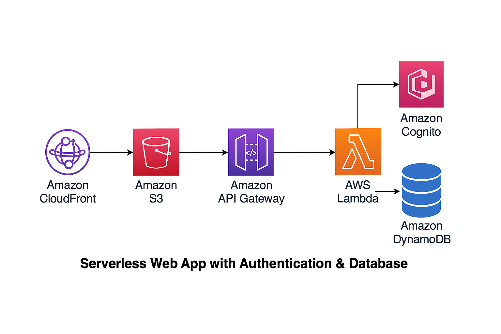
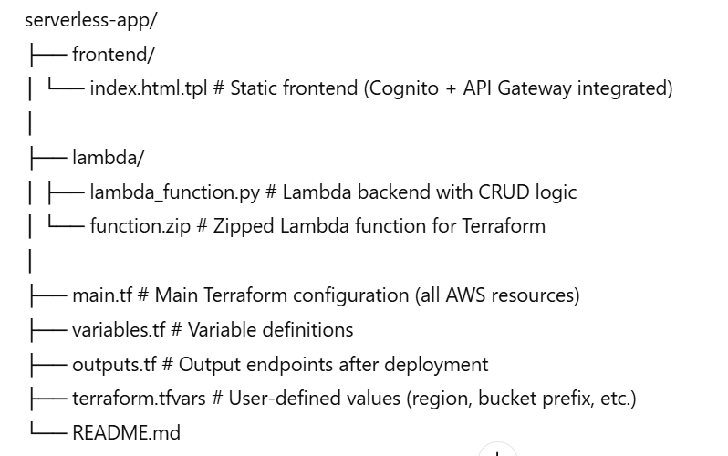
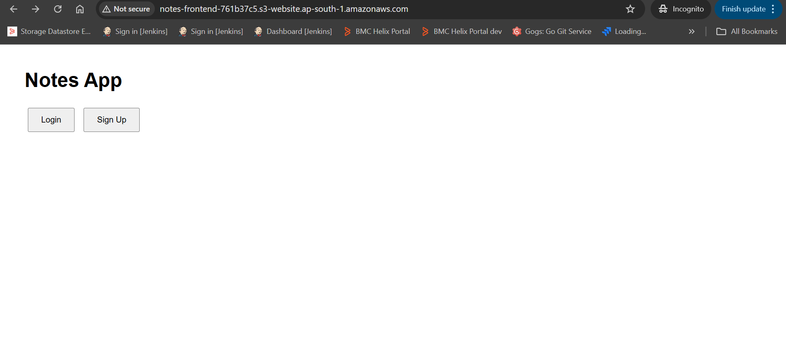
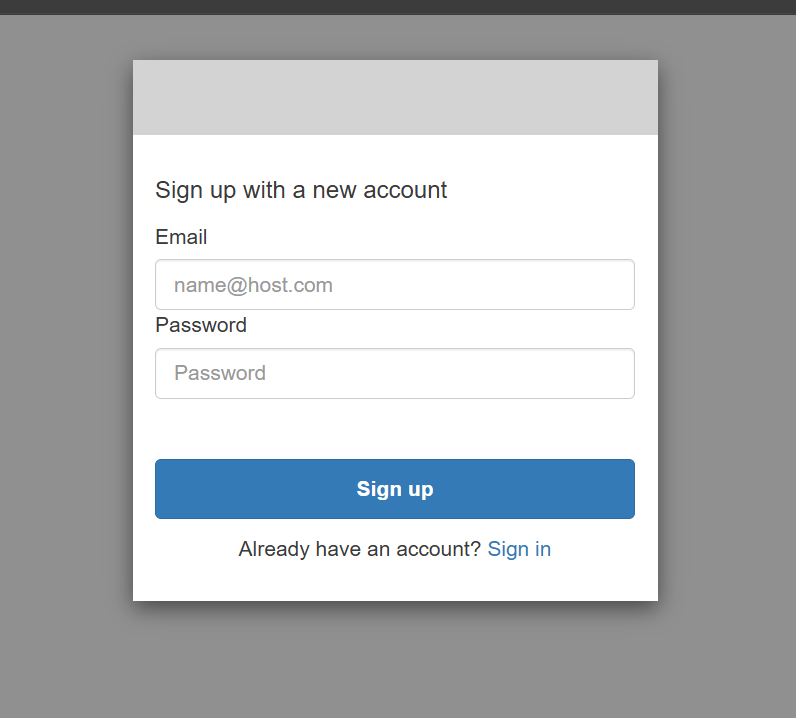

# AWS Serverless Web Application — Notes App  

This project demonstrates a **fully serverless web application** built on AWS using **Terraform**.  
It provides **secure user authentication**, **API-based backend**, and **scalable data storage**, all without managing servers.

---

## Project Overview

| Service | Purpose |
|----------|----------|
| **Amazon S3 + CloudFront** | Host and serve the frontend web app |
| **Amazon Cognito** | Manage user authentication (Sign-up / Login / Logout) |
| **Amazon API Gateway** | Expose RESTful APIs for the backend |
| **AWS Lambda** | Serverless compute to handle CRUD operations |
| **Amazon DynamoDB** | NoSQL database to store user notes |
| **Amazon CloudWatch** | Logging and monitoring |
| **Terraform** | Infrastructure as Code for automated deployment |

---

## Architecture

---

## 📂 Project Structure

---

## ⚙️ Features

- **User Authentication** using AWS Cognito Hosted UI (Sign Up / Login / Logout)
- **Frontend Hosting** on S3, served securely via CloudFront
- **Serverless Backend** using AWS Lambda + API Gateway (with JWT Authorization)
- **Database Layer** built on DynamoDB for scalable storage
- **API-Driven Architecture** (Create, Read, Update, Delete notes)
- **IAM Role-Based Access** for secure service-to-service interaction
- **Terraform Automation** — deploy full infrastructure in minutes

---

## Step-by-Step Setup Instructions

1️⃣ Initialize Terraform

    cd terraform
    terraform init

2️⃣ Plan Deployment

    terraform plan

3️⃣ Apply Infrastructure

    terraform apply -auto-approve

    This step:

      - Creates S3 bucket for frontend
      - Deploys Lambda, API Gateway, DynamoDB
      - Configures Cognito for authentication
      - Generates CloudFront distribution URL

4️⃣ Get the Outputs

    terraform output

    You’ll see:

      - api_invoke_url — API Gateway endpoint
      - s3_website_url — Frontend URL
      - cognito_user_pool_id
      - cognito_client_id
      - cognito_domain

5️⃣ Access the Web App

    - Open the S3 website URL or CloudFront URL in your browser.
    - Click Sign Up to create a user
    - Login via Cognito Hosted UI
    - Add, view, and manage notes — all through the API Gateway

## Sample Output

 
